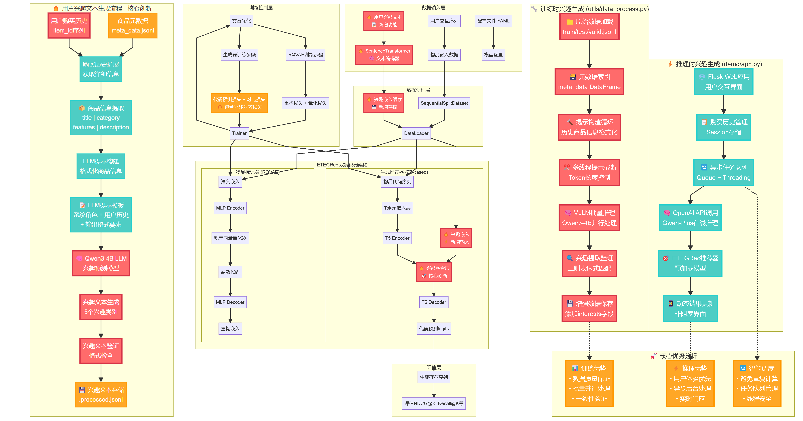

# From Text to Recommendations: LLM-Guided Interest Tokenization via T5 and Cross-Attention in Generative Models 

<div align="center">
    <a href="https://github.com/ccmoony/DM_Project/" target="_blank">
    </a>
    <a href="https://ccmoony.github.io/DM_website/" target="_blank">
    </a>
</div>

ETEGRec is a SOTA end-to-end generative recommender system that integrates item tokenization and recommendation generation. However, its latent item tokenization process fails to take into account the high-level semantic information of user interests, which can lead to suboptimal recommendations. To address this, we introduce a brand new interest fusion mechanism that leverages user interest text embeddings to enhance the recommendation process. 

## Methodology



### LLM-Guided Interest Prediction

We utilize a large language model (LLM) to extract user interests from their purchase history and item metadata. The LLM generates structured interest categories, which are then used to enhance the recommendation process.

### Interest Fusion Mechanism

We implement a multi-layer cross-attention mechanism to fuse user interest embeddings with item sequence representations. This allows the model to better capture the semantic relationships between user interests and items, leading to more accurate recommendations.

### Integrating synchronous training and asynchronous inference procedure

During training, user interest are pre-processed. We use cached synchronous batch processing to ensure data consistency and quality. In the inference phase, we employ asynchronous processing to optimize user experience, allowing for real-time updates without blocking the user interface.

## Deployment
### Configuration
```bash
pip install -r requirements.txt
```
### Training

You should first install the dependencies below for ETEGRec. Also make sure some necessary libraries, e.g. `sentence-transformers`, are installed. I have provided the processed dataset (.processed.jsonl) along with the pretrained RQVAE weights and SASRec embeddings in the `data` folder. If you want to use your own dataset, modify the `data_process.py` script to suit your needs.

Then, run the shell script:
```bash
bash run.sh
```
to train the ETEGRec model. This will utilize the preprocessed data and pretrained weights to train the model.

### Evaluation results
We evaluate our work on the Amazon Reviews'23 Industrial and Scientific dataset. The evaluation results of ETEGRec on the test set are as follows:

| Model   | Best Validation Score | recall@1     | recall@5     | ndcg@5       | recall@10    | ndcg@10      |
| ------- | --------------------- | ------------ | ------------ | ------------ | ------------ | ------------ |
| ETEGRec | 0.027147              | 0.008159     | **0.027538** | 0.017766     | 0.041797     | 0.022369     |
| Ours    | **0.027795**          | **0.008669** | 0.027165     | **0.017943** | **0.043503** | **0.023199** |
| Boost   | 2.39%                 | 6.25%        | -1.35%       | 1.00%        | 4.08%        | 3.71%        |


### Demo
You should first set the environment variable `DASHSCOPE_API_KEY` to your DashScope API Key. Then run the following command to start the FastAPI server for inference:
```bash
cd demo
python app.py
```
this will start a web server watching port 5000. You can access the demo interface at `http://localhost:5000`.

## Thanks
This is project is based on the codebases [ETEGrec](https://github.com/BishopLiu/ETEGRec). We gratefully thank the authors for their wonderful works.
